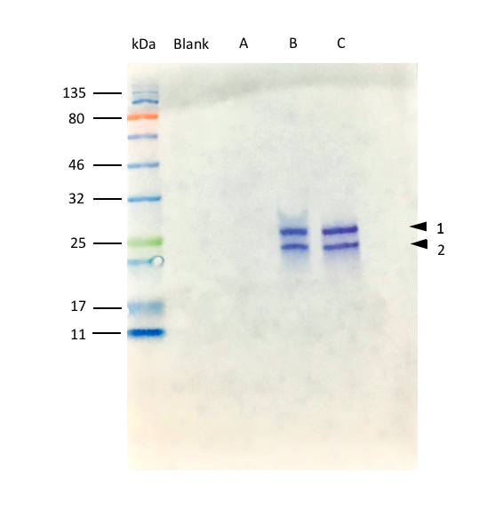

```{r setup, include=FALSE}
knitr::opts_chunk$set(echo = FALSE, 
                      warning = FALSE,
                      message = FALSE)
```

```{r packages}
library(tidyverse)
library(ggplot2)
library(flowCore)
library(flowAI)
library(ggcyto)
```

<!-- Provide an introduction to the experiment, why it's important/it's application in context -->
# Introduction
Macrophages are mononuclear cells with high phagocytic activity, [@Schnyder1978-er]. They have key roles in the immune responses, particularly the production of proinflammatory cytokines and the phagocytosis of microorganisms, [@Murray2005-ei]. 

Phagocytosis is a major function of the macrophage, not only for pathogens, but also for the resolution of inflammation through the phagocytosis of other immune cells, such as neutrophils, [@Newman1982-of].

The necrosis of tumours in response to bacterial-endotoxins was first determined to be an indirect process by, [@OMalley1962-lb], in which the necrosis could be triggered by a serum, derived from animals treated with lipopolysaccharides (LPS), in animals not exposed to LPS. This was deemed to be mediated by a "tumour necrotizing factor" later determined to be a superfamily that includes the protein Tumour Necrosis Factor-$\alpha$ (TNF-$\alpha$). 

Understanding the mechanisms by which macrophages are activated, and their subsequent production of TNF-$\alpha$, is important for aiding research into chronic inflammatory diseases such as rheumatoid arthritis and multiple sclerosis, [@Plevy1997-fw]. Uncontrolled macrophage activation is noted to be key in such chronic inflammatory diseases, [@Sindrilaru2011-qj], with TNF-$\alpha$ being classed as a proinflammatory macrophage marker. 

The aim of this study is to gain understanding of the mechanisms by which macrophages are activated/respond and produce TNF-$\alpha$, specifically with regards to the necessity of phagocytosis in the production of TNF-$\alpha$. 

<!-- Decide whether to include the images and results from the western blot analysis of own results -->
<!-- This could allow me to show import of image  -->
# Is phagocytosis required to trigger the production of TNF-$\alpha$ by mcrophages? 

The TNF-$\alpha$ production from RAW 264.7 cells is shown in Figures \@ref(fig:western-blot-figure) and \@ref(fig:Rf-figure). Membranes from the SDS-PAGE were incubated with the primary antibody solution, rabbit anti-TNF-$\alpha$ in TBS-T with 5% milk, and consequently incubated with the secondary antibody solution, goat anti-rabbit IgG-linked to horseradish peroxidase in PBS-T in milk. 

All cells were treated with Brefeldin-A, an inhibitor of protein transport and secretion, in order to enhance the intracellular cytokine (TNF-$\alpha$) staining signal for the Western Blot Analysis. 

Figure \@ref(fig:western-blot-figure) indicates that only RAW 264.7 cells treated with 100 ng/ml LPS from *E.coli* and RAW 264.7 cells treated with *E.coli* bacteria produced TNF-$\alpha$, as shown by the bands labelled B1, B2, C1 and C2 respectively. 

Figure \@ref(fig:Rf-figure), illustrates the calculation of the molecular weights of the labelled bands from Figure \@ref(fig:western-blot-figure), using the calculated molecular weights of the molecular marker bands. From the calculated molecular weights of Figure \@ref(fig:Rf-figure), the identity of the bands on the Western Blot can be confirmed to be that of TNF-$\alpha$. 

Bands B1 and C1 calculated to be 28.3 kDa and 27.11 kDa respectively. Bands B2 and C2 calculated to be 22.9 kDa and 23.89 kDa respectively. These were compared to the datasheet, [@CellSignal2017-rp] and [@UniProtConsortium2019-su], to confirm the identification of the TNF-$\alpha$ bands. 

```{r western-blot-figure, fig.cap='(ref:western)', out.width="50%"}

```

<!-- figure legend -->

(ref:western) **Western blot from SDS-PAGE, analysis of TNF-$\alpha$ in RAW 264.7 cells treated with Brefeldin-A. <BR> (A)** Untreated RAW 264.7 cells <BR> **(B)** RAW 264.7 cells treated with 100 ng/ml LPS from *E.coli* <BR> **(C)** RAW 264.7 cells treated with *E.coli* bacteria

<!-- end of figure legend -->

```{r calculating Rf value, echo=FALSE}
Rf <- read.csv("data-raw/Western Blot.csv")

ggplot(Rf, aes(Rf.Value, Log.of.Molecular.Weight..Da.)) +
         geom_point() +
  ylab("Log of Molecular Weight (Da)") +
  xlab("Rf Value") +
  theme_classic() +
  geom_vline(xintercept = 0.6, col = "red") +
  geom_hline(yintercept = 4.4516,col = "red") +
  geom_abline(slope = -1.099, intercept = 5.111)
  geom_smooth(method = "lm")

str(Rf)

#points(x = 0.6, y = 4.4516, col="red")
  
model <- lm(Log.of.Molecular.Weight..Da. ~ Rf.Value, data = Rf)
model

```


```{r Rf-figure, echo=FALSE, fig.cap='(ref:Rf-value)'}

Rf_figure <- ggplot(Rf, aes(Rf.Value, Log.of.Molecular.Weight..Da.)) +
  geom_point() +
  ylab("Log of Molecular Weight (Da)") +
  xlab("Rf Value") +
  theme_bw() +
  stat_smooth(method = "lm", se = FALSE, col = "black") +
  geom_vline(xintercept = 0.6, col = "red", lty = 2) +
  geom_hline(yintercept = 4.4516,col = "red", lty = 2) +
  theme(panel.background = element_rect(fill = "white"))+
  theme(axis.line.x = element_line(color = "black"),
        axis.line.y = element_line(color = "black")) +
  geom_vline(xintercept = 0.6167, col = "blue", lty = 2) +
  geom_hline(yintercept = 4.4332, col = "blue", lty = 2) +
  geom_vline(xintercept = 0.6833, col = "red") +
  geom_hline(yintercept = 4.3601, col = "red") + 
  geom_vline(xintercept = 0.6667, col = "blue") +
  geom_hline(yintercept = 4.3782, col = "blue") +
  annotate("text", x = 0.9, y = 5.5, label = "- - - = B1", col = "red") +
  annotate("text", x = 0.9, y = 5.4, label = "___ = B2", col = "red") +
  annotate("text", x = 0.9, y = 5.3, label = "- - - = C1", col = "blue") +
  annotate("text", x = 0.9, y = 5.2, label = "___ = C2", col = "blue") +
  geom_text(aes(0.2, 5.4, label=(paste(expression("y = -1.099x " + 5.111)))),parse = TRUE)

Rf_figure

ggsave("figures/Rf_figure.png", Rf_figure)

```

<!-- figure legend -->

(ref:Rf-value) **Identification of the Molecular Weight of TNF-$\alpha$ using Rf values** <BR> **Dashed Red** - B1 band shown in Figure \@ref(fig:western-blot-figure), **Red** - B2 band shown in Figure \@ref(fig:western-blot-figure), **Dashed Blue** - C1 band shown in Figure \@ref(fig:western-blot-figure), **Blue** - C2 band shown in Figure \@ref(fig:western-blot-figure).

<!-- end of figure legend -->

<!-- Provide some explanation and background information on the protocol of Flow Cytometry, maybe include a brief description and comparison to Summit -->
<!-- There is a user guide to Summit on the VLE? -->
# Determining the level of TNF-$\alpha$ expression using Flow Cytometry

The western blotting results looked at the overall effect of LPS and bacteria on a population of cells, without distinction between individual cells. Flow cytometry can be used to analyse the production of TNF-$\alpha$ by individual RAW 264.7 macrophage cells. 

## Principles of Flow Cytometry 

Flow cytometry involves a cell susupension being passed through a flow chamber, so that cells pass in front of lasers one-by-one. This results in light being scattered and detected by forward and side scatter detectors, allowing the determination of size and granularity. Fluorescence detectors also detect any fluorescently tagged cells for identification of specific markers. 

For an overview of the technique please see the video, [@Mitedustar2015-tp]. 

```{r flow cytometry video}
knitr::include_url("https://www.youtube.com/embed/EQXPJ7eeesQ")
```

<!-- Description of the methods for this analysis of data, and explanation of the packages used, including the bioconductor packages flowCore etc. -->
# Methods


<!-- Link for Bioconductor How to guide: https://bioconductor.org/packages/devel/bioc/vignettes/flowCore/inst/doc/HowTo-flowCore.pdf -->


# Data Import and Tidying

The data contains two samples:

**Sample 1:** treated with Brefeldin A only (Unstimulated)
1A: not stained
1B: stained for intracellular TNF-$\alpha$ production, detected with an anti-rabbit 488 (Green)

**Sample 2:** treated with Brefeldin A and red-fluorescent (rhodamine) bacteria (Stimulated LPS Treated)
2A: not stained 
2B: stained for intracellular TNF-$\alpha$ production, detected with an anti-rabbit 488 (Green)

```{r reading in the data}
file1A <- "data-raw/class-sample/class 1A.fcs"
fcm1A <- read.FCS(file1A, alter.names = TRUE) # alter.names argument 

file1B <- "data-raw/class-sample/class 1B.fcs"
fcm1B <- read.FCS(file1B, alter.names = TRUE)

file2A <- "data-raw/class-sample/class 2A.fcs"
fcm2A <- read.FCS(file2A, alter.names = TRUE)

file2B <- "data-raw/class-sample/class 2B.fcs"
fcm2B <- read.FCS(file2B, alter.names = TRUE)

```

# Compensation

When using more than one fluorochrome is used, there is the possibility for their emission spectra to overlap. The overlap is often termed 'spillover' and this needs to be removed from the flow cytometry data through a process called compensation, [@ONeill2013-ub]. 

```{r compensating the data, include=FALSE}

# each FCS file should contain compensation data

#Sample 1A
spillover(fcm1A) #check to see which keyword the compensation data is under

# names in spillover matrix don't match the flowFrame so need to change the matrix colnames

matrix1A <- spillover(fcm1A)$`$SPILLOVER`
matrix1A
colnames(matrix1A) <- c("FL.1.Log", "FL.3.Log", "FL.4.Log")

fcm1A_comp <- compensate(fcm1A, matrix1A)

# repeat for each file

#Sample 1B
spillover(fcm1B) 

matrix1B <- spillover(fcm1B)$`$SPILLOVER`
matrix1B
colnames(matrix1B) <- c("FL.1.Log", "FL.3.Log", "FL.4.Log")

fcm1B_comp <- compensate(fcm1B, matrix1B)

#Sample 2A
spillover(fcm2A) 

matrix2A <- spillover(fcm2A)$`$SPILLOVER`
matrix2A
colnames(matrix2A) <- c("FL.1.Log", "FL.3.Log", "FL.4.Log")

fcm2A_comp <- compensate(fcm2A, matrix2A)

#Sample 2B
spillover(fcm2B)

matrix2B <- spillover(fcm2B)$`$SPILLOVER`
matrix2B
colnames(matrix2B) <- c("FL.1.Log", "FL.3.Log", "FL.4.Log")

fcm2B_comp <- compensate(fcm2B, matrix2B)

# As the spillover matrices are the same in each sample - can try and read in as a flowSet instead and apply over all at the same time (if time allows at the end)

```

# Transformation


```{r transforming the data}
# library(data.table)
# which(colnames(fcm1A_comp) %like% ".Log")
# fcm1A_comp

trans1A <- estimateLogicle(fcm1A_comp, colnames(fcm1A_comp[, c(1:5, 7:8, 10:11, 13:14, 16:17,
                                                               19:20, 22:23, 25:26, 28:29, 31:32, 24:35)]))
fcm1A_comp_trans <- transform(fcm1A_comp, trans1A)


trans1B <- estimateLogicle(fcm1B_comp, colnames(fcm1B_comp[, c(1:5, 7:8, 10:11, 13:14, 16:17,
                                                               19:20, 22:23, 25:26, 28:29, 31:32, 24:35)]))
fcm1B_comp_trans <- transform(fcm1B_comp, trans1B)

trans2A <- estimateLogicle(fcm2A_comp, colnames(fcm2A_comp[, c(1:5, 7:8, 10:11, 13:14, 16:17,
                                                               19:20, 22:23, 25:26, 28:29, 31:32, 24:35)]))
fcm2A_comp_trans <- transform(fcm2A_comp, trans2A)

trans2B <- estimateLogicle(fcm2B_comp, colnames(fcm2B_comp[, c(1:5, 7:8, 10:11, 13:14, 16:17,
                                                               19:20, 22:23, 25:26, 28:29, 31:32, 24:35)]))
fcm2B_comp_trans <- transform(fcm2B_comp, trans2B)

# Logicle is different to Log - carry out analysis for both to see which works better. 

```

# Results

```{r visualise transformed data}

autoplot(fcm1A_comp)
autoplot(fcm1B_comp)
autoplot(fcm2A_comp)
autoplot(fcm2B_comp) # doesn't visualise very well without transformation
autoplot(fcm1A_comp_trans)
autoplot(fcm1B_comp_trans)
autoplot(fcm2A_comp_trans)
autoplot(fcm2B_comp_trans)

```

```{r plot log channel data}

ggcyto(fcm1A_comp_trans, aes(x = "FS.Log", y = "SS.Log")) + geom_hex(bins = 100) + theme_bw()

ggcyto(fcm1B_comp_trans, aes(x = "FS.Log", y = "SS.Log")) + geom_hex(bins = 100) + theme_bw()

ggcyto(fcm2A_comp_trans, aes(x = "FS.Log", y = "SS.Log")) + geom_hex(bins = 100) + theme_bw()

ggcyto(fcm2B_comp_trans, aes(x = "FS.Log", y = "SS.Log")) + geom_hex(bins = 100) + theme_bw()

```

```{r plot logicle transformed data}

ggcyto(fcm1A_comp_trans, aes(x = "FS.Lin", y = "SS.Lin")) + geom_hex(bins = 100) + theme_bw()

ggcyto(fcm1B_comp_trans, aes(x = "FS.Lin", y = "SS.Lin")) + geom_hex(bins = 100) + theme_bw()

ggcyto(fcm2A_comp_trans, aes(x = "FS.Lin", y = "SS.Lin")) + geom_hex(bins = 100) + theme_bw()

ggcyto(fcm2B_comp_trans, aes(x = "FS.Lin", y = "SS.Lin")) + geom_hex(bins = 100) + theme_bw()

```

```{r scatter plot of 1a, include=FALSE}

# fcm1Adf %>% 
#   select(FS.Lin, SS.Lin) %>% 
#   ggplot(aes(x = FS.Lin, y = SS.Lin)) +
#   geom_point(alpha = 0.08)

```

```{r creating a polygongate sample 1a}

# poly5 <- matrix(c(20000, 0,
#                   50000, 0,
#                   50000, 60000,
#                   20000, 60000), 
#                 ncol = 2, 
#                 nrow = 4, 
#                 byrow = T)
# 
# colnames(poly5) <- c("FS.Lin","SS.Lin")
# 
# gate_r1 <- polygonGate(poly5, filterId = "gate_r1")
# 
# 
# fcm1A_gate_r1 <- Subset(fcm1A, gate_r1)
# 
# fcm1A_gate_r1df <- data.frame(fcm1A_gate_r1@exprs)
# 
# fig_gate_1A <- ggplot(data = fcm1Adf, aes(x = FS.Lin, y = SS.Lin)) +
#   geom_point(alpha = 0.5) +
#   geom_point(data = fcm1A_gate_r1df, 
#              aes(x = FS.Lin, y = SS.Lin), color = "red") 

```

```{r scatter plot of 1b, include=FALSE}

# fcm1Bdf %>%
#   select(FS.Lin, SS.Lin) %>%
#   ggplot(aes(x = FS.Lin, y = SS.Lin)) +
#   geom_point(alpha = 0.08)

```

```{r gating sample 1b}

# fcm1B_gate_r1 <- Subset(fcm1B, gate_r1)
# 
# fcm1B_gate_r1df <- data.frame(fcm1B_gate_r1@exprs)
# 
# fig_gate_1B <- ggplot(data = fcm1Bdf, aes(x = FS.Lin, y = SS.Lin)) +
#   geom_point(alpha = 0.5) +
#   geom_point(data = fcm1B_gate_r1df, 
#              aes(x = FS.Lin, y = SS.Lin), color = "red") 

```

```{r scatter plot of 2a, include=FALSE}

# fcm2Adf %>%
#   select(FS.Lin, SS.Lin) %>%
#   ggplot(aes(x = FS.Lin, y = SS.Lin)) +
#   geom_point(alpha = 0.08)

```

```{r gating sample 2a}

# fcm2A_gate_r1 <- Subset(fcm2A, gate_r1)
# 
# fcm2A_gate_r1df <- data.frame(fcm2A_gate_r1@exprs)
# 
# fig_gate_2A <- ggplot(data = fcm2Adf, aes(x = FS.Lin, y = SS.Lin)) +
#   geom_point(alpha = 0.5) +
#   geom_point(data = fcm2A_gate_r1df, 
#              aes(x = FS.Lin, y = SS.Lin), color = "red") 

```

```{r scatter plot of 2b, include=FALSE}

# fcm2Bdf %>%
#   select(FS.Lin, SS.Lin) %>%
#   ggplot(aes(x = FS.Lin, y = SS.Lin)) +
#   geom_point(alpha = 0.08)

```

```{r gating sample 2b}

# fcm2B_gate_r1 <- Subset(fcm2B, gate_r1)
# 
# fcm2B_gate_r1df <- data.frame(fcm2B_gate_r1@exprs)
# 
# fig_gate_2B <- ggplot(data = fcm2Bdf, aes(x = FS.Lin, y = SS.Lin)) +
#   geom_point(alpha = 0.5) +
#   geom_point(data = fcm2B_gate_r1df, 
#              aes(x = FS.Lin, y = SS.Lin), color = "red") 


```


```{r combined-plot-for-initial-gating, fig.cap='(ref:gated-population)'}

#ggpubr::ggarrange(fig_gate_1A, fig_gate_2A, labels = c("A", "B"), cols = 2)

```

<!-- figure legend -->

(ref:gated-population) **Flow Cytometry Analysis of RAW 264.7 cells (A-C): Forward-Scatter, Side-Scatter Plots of RAW 264.7 cells Unstimulated, Treated with 100 ng/ml LPS from *E.coli* and Treated with *E.coli* bacteria respectively.**

<!-- end of figure legend -->

```{r histogram plot}


```


```{r word count}


```


# References

